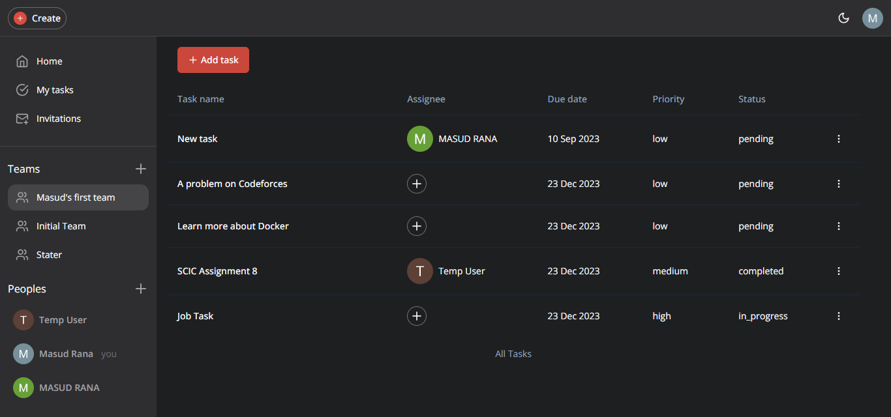

<h1 align="center">
TaskifyPro | Manage Task with Teams</h1>

This is the repository for TaskifyPro an Online Task Management Site with  Next.js, TypeScript, Tailwind ShadcnUI, and Clark.

## 📝 Features

- In this React.js application, implemented admin, contest creator, and user authorization.
- Admin can
  approve or reject submitted contests, view and manage all contests, delete any contest, manage users and their roles (admin, contest creator, user).
- The contest creator can add contests, edit and manage created contests, view submissions, and declare contest winners.
- Users can register for contests and submit tasks, track progress in registered contests, view past participation details and winnings,
  update profile information.
- Stripe payment integration, fully responsive, pagination, JWT, leaderboards for top participants, toast notifications, login, and register.
- Coin systems allow creators to purchase coins for creating a specific number of contests.

## 🚀 Important Links

- Live Website link: [https://contest-platform-d8309.web.app](https://contest-platform-d8309.web.app)
- Server site repo link: [https://github.com/masud-rana44/talent-hunt-server](https://github.com/masud-rana44/talent-hunt-server)

## 🔐 Demo Account

Explore the application using these demo accounts:

- **Admin**: (Email: admin@example.com, Password: #Test1234)
- **Contest Creator**: (Email: creator@example.com, Password: #Test1234)
- **User**: (Email: user@example.com, Password: #Test1234)

## 💻 Technology Used

The contest site is built using the following technologies and libraries:

| Frontend Technologies | Backend Technologies  |
| --------------------- | --------------------- |
| React                 | Express               |
| Tailwind CSS          | MongoDB               |
| Firebase              | Mongoose              |
| Material-UI           | JWT (JSON Web Tokens) |
| React Query           | Stripe                |
| Axios                 |
| Framer Motion         |
| React Router          |
| React Hook Form       |
| Swiper                |
| Recharts              |
| Moment                |
| React Spinners        |
| React Dropzone        |
| React Countdown       |
| React Hot Toast       |
| React Icons           |
| Query String          |
| React Helmet Async    |
| Cloudinary            |

<h3>💖Like my work?</h3>

This project needs a ⭐️ from you. Don't forget to leave a star ⭐️.
